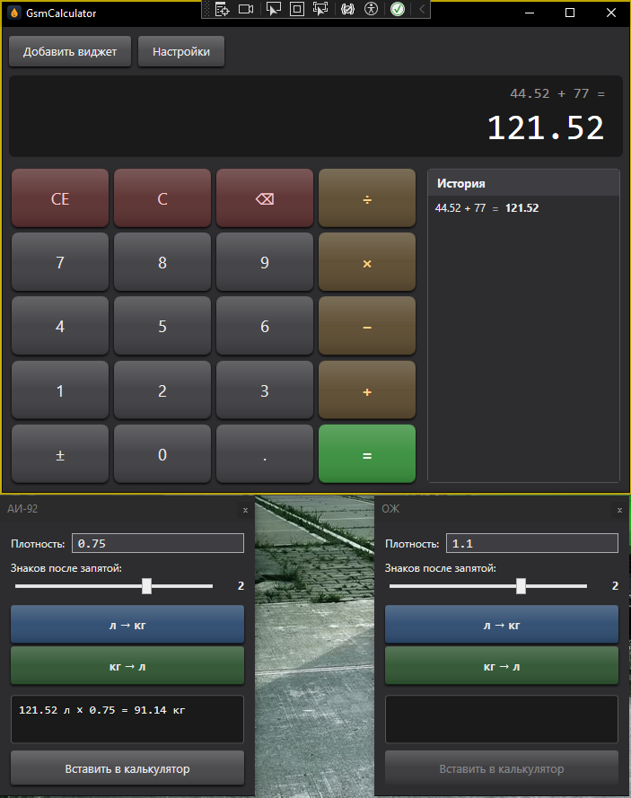
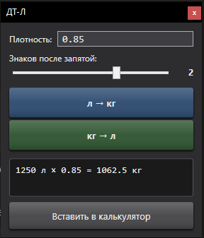
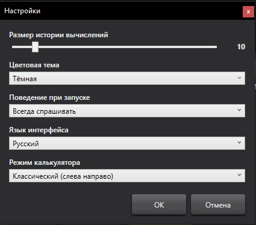

# GsmCalculator

> Десктоп-калькулятор на WPF для расчётов ГСМ — стандартные операции
> плюс плавающие виджеты для конвертации литров и килограммов
> по плотности топлива.

[](https://github.com/Vanchestery/GsmCalculator/actions/workflows/ci.yml)
[](https://dotnet.microsoft.com/)
[](https://learn.microsoft.com/dotnet/desktop/wpf/)
[](LICENSE)

## Описание

Приложение для расчётов на складах ГСМ (горюче-смазочных материалов).
Совмещает обычный калькулятор и плавающие виджеты для каждого вида
топлива (АИ-92, ДТ-Л, ДТ-З, ТС-1, Масла, ТЖ, ОЖ) с конвертацией
л↔кг по плотности.

## Скриншоты





## Возможности

- **Калькулятор** в двух режимах:
  - **Classic** — операции слева направо (как Windows Calc Standard).
  - **Engineering** — приоритет × и ÷ над + и −.
- **Двухстрочный дисплей** с превью выражения над текущим числом.
- **История вычислений** с настраиваемым размером (5..50).
- **Клавиатурные шорткаты** для всех операций (D0-D9, NumPad, +/−/×/÷, Enter=, Esc=C, Backspace, Delete=CE).
- **Плавающие виджеты** конвертации л↔кг:
  - Встроенные: АИ-92, ДТ-Л, ДТ-З, ТС-1, Масла, ТЖ, ОЖ.
  - Своя плотность (для переменных) и округление 0..3 знака.
  - Кнопка «Вставить в калькулятор» отправляет результат на дисплей.
- **Создание пользовательских виджетов** с фиксированной/переменной плотностью.
- **Три цветовые темы** Light / Dark / Blue с тёмной полосой заголовка через DWM (Windows 10 1809+).
- **Локализация RU/EN** на лету через `ResourceDictionary` и `DynamicResource`.
- **Сохранение сессии**: дисплей, история, открытые виджеты и их позиции восстанавливаются между запусками.
- **Готовые сборки** для Windows x64 публикуются в [Releases](https://github.com/Vanchestery/GsmCalculator/releases) при пуше тега `v*`.

## Технологический стек

| Слой | Технология |
|------|------------|
| Язык / Платформа | C# 13, .NET 9 (`net9.0-windows`) |
| UI | WPF, XAML, MVVM |
| DI | `Microsoft.Extensions.DependencyInjection` |
| Сериализация | `System.Text.Json` |
| Тесты | xUnit 2.9, Moq 4.20 |
| CI / CD | GitHub Actions |

## Архитектура

Чистый MVVM с разделением на 4 слоя:

```
GsmCalculator/
├── Models/         POCO-модели данных
├── ViewModels/     MVVM ViewModels (INotifyPropertyChanged)
├── Views/          XAML-окна + code-behind
├── Services/       Бизнес-логика и инфраструктура
│   ├── ICalculatorService     математика
│   ├── IConversionService     л↔кг
│   ├── ISettingsService       JSON-настройки
│   ├── IWidgetService         каталог виджетов
│   ├── ISessionService        сохранение сессии
│   ├── ILocalizationService   локализация
│   ├── IThemeService          цветовые темы
│   └── I*WindowService        открытие окон без знания о View
├── Resources/
│   ├── Themes/                LightTheme / DarkTheme / BlueTheme
│   ├── Strings.ru.xaml        русские строки
│   ├── Strings.en.xaml        английские строки
│   ├── ControlStyles.xaml     кастомный 3D-шаблон Button
│   └── app.ico
└── Helpers/
    └── ButtonProps.cs         attached property для CornerRadius
```

**Ключевые архитектурные решения:**

- **Views не знают про сервисы** — только через биндинги к ViewModels.
- **ViewModels не знают про View-классы** — открытие окон через `I*WindowService`-абстракции.
- **DI** конфигурируется в `App.OnStartup`. Сервисы окон получают `IServiceProvider` и **лениво** резолвят `MainViewModel` — это разрывает циклическую зависимость (`MainViewModel` → `IAddWidgetWindowService` → `AddWidgetViewModel` → `MainViewModel`).
- **Темы и язык** переключаются на лету через подмену `ResourceDictionary` + `DynamicResource` в XAML.
- **Долгоживущие VM** (Widget, AddWidget) подписаны на `LanguageChanged` и реализуют `IDisposable` — иначе синглтон `LocalizationService` держал бы ссылки на закрытые VM (утечка памяти).
- **Сессия**: при `MainWindow.Closing` снимаются позиции виджетов до их закрытия. `ShutdownMode=OnMainWindowClose` гарантирует завершение приложения при закрытии главного окна.

## Сборка и запуск

Требуется **.NET 9 SDK** и **Visual Studio 2022** 17.12+ (или JetBrains Rider 2024.3+).

```bash
git clone https://github.com/Vanchestery/GsmCalculator.git
cd GsmCalculator
dotnet restore
dotnet build
dotnet run --project GsmCalculator
```

Или открыть `GsmCalculator.sln` в Visual Studio и нажать **F5**.

### Готовая сборка

Скачать последнюю Windows-сборку (self-contained, не требует .NET Runtime):
[Releases](https://github.com/Vanchestery/GsmCalculator/releases)

## Тесты

```bash
dotnet test
```

~80 тестов на xUnit + Moq:
- сервисы (CalculatorService, ConversionService, SettingsService, WidgetService, SessionService);
- MainViewModel — state machine, оба режима калькулятора, история, ошибки.

## Где хранятся пользовательские данные

`%AppData%\GsmCalculator\`:
- `settings.json` — настройки приложения;
- `widgets.json` — каталог виджетов (встроенные + пользовательские);
- `session.json` — сохранённая сессия (если есть).

## Лицензия

[MIT](LICENSE) © 2026
