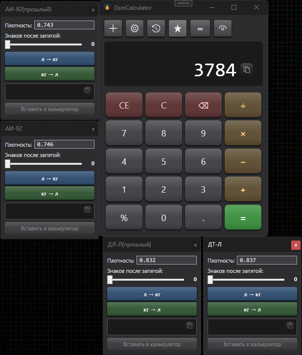
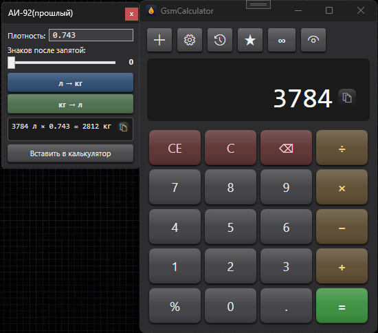
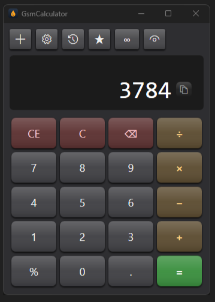
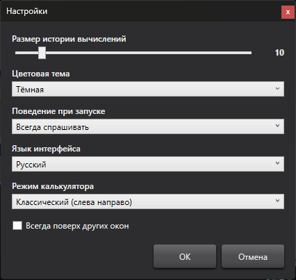

# GsmCalculator
> Desktop WPF calculator for fuel (GSM) warehouse math — standard operations
> plus floating widgets that convert litres ↔ kilograms by fuel density.
[](https://github.com/Vanchestery/GsmCalculator/actions/workflows/ci.yml)
[](https://dotnet.microsoft.com/)
[](https://learn.microsoft.com/dotnet/desktop/wpf/)
[](LICENSE)
## Overview
App for warehouse GSM (fuels and lubricants) calculations.
Combines a normal calculator with floating per-fuel widgets (AI-92, DT-L, DT-Z, TS-1, oils, technical fluids, coolants) that convert L ↔ kg using density.
## Screenshots




## Features
- **Calculator** in two modes:
  - **Classic** — left-to-right evaluation (like Windows Calculator Standard).
  - **Engineering** — × and ÷ bind tighter than + and −.
- **Two-line display** with expression preview above the current number.
- **History** with configurable size (5..50).
- **Keyboard shortcuts** for all operations (D0–D9, NumPad, +/−/×/÷, Enter=, Esc=C, Backspace, Delete=CE).
- **Floating L ↔ kg widgets:**
  - Built-ins: AI-92, DT-L, DT-Z, TS-1, oils, technical fluids, coolants.
  - Custom density (fixed or variable) and rounding 0..3 decimals.
  - “Insert into calculator” sends the result to the display.
  - One top-bar click hides all open widgets and restores the same set later.
- **Always on top** — optional: calculator and widgets above other windows, or normal z-order (by default widgets follow the calculator under the active app).
- **Custom widgets** with fixed/variable density.
- **Favorites** — pinned widgets on the main-window side panel.
- **Display rounding** cycle in the top bar: off / integers / 0.1.
- **Three themes** Light / Dark / Blue with a dark title bar via DWM (Windows 10 1809+).
- **RU/EN localization** on the fly via `ResourceDictionary` and `DynamicResource`.
- **Session restore**: display, history, open widgets and positions survive restarts.
- **Ready-made Windows x64 builds** in [Releases](https://github.com/Vanchestery/GsmCalculator/releases) when you push a `v*` tag.
## Stack
| Layer | Tech |
|------|------|
| Language / runtime | C# 13, .NET 9 (`net9.0-windows`) |
| UI | WPF, XAML, MVVM |
| DI | `Microsoft.Extensions.DependencyInjection` |
| Serialization | `System.Text.Json` |
| Tests | xUnit 2.9, Moq 4.20 |
| CI / CD | GitHub Actions |
## Architecture
Clean MVVM split into four layers:
```
GsmCalculator/
├── Models/         POCO data models
├── ViewModels/     MVVM ViewModels (INotifyPropertyChanged)
├── Views/          XAML windows + code-behind
├── Services/       Business logic and infrastructure
│   ├── ICalculatorService      math
│   ├── IConversionService      L ↔ kg
│   ├── ISettingsService        JSON settings
│   ├── IWidgetService          widget catalog
│   ├── IFavoritesService       pinned widgets
│   ├── ISessionService         session persistence
│   ├── IWindowStateService     main window position
│   ├── IWindowMagnetismService widget snapping
│   ├── ILocalizationService    localization
│   ├── IThemeService           themes
│   └── I*WindowService         open windows without knowing Views
├── Resources/
│   ├── Themes/                 LightTheme / DarkTheme / BlueTheme
│   ├── Strings.ru.xaml         Russian strings
│   ├── Strings.en.xaml         English strings
│   ├── ControlStyles.xaml      custom 3D Button template
│   └── app.ico
└── Helpers/
    ├── ButtonProps.cs          CornerRadius attached property
    ├── RoundingFormatter.cs    display rounding modes
    ├── MagnetismCalculator.cs  snap geometry
    └── TitleBarHelper.cs       dark title bar (DWM)
```
**Key decisions:**
- **Views never talk to services** — only bindings to ViewModels.
- **ViewModels never know View types** — windows open through `I*WindowService` abstractions.
- **DI** is wired in `App.OnStartup`. Window services take `IServiceProvider` and **lazily** resolve `MainViewModel` to break the cycle (`MainViewModel` → `IAddWidgetWindowService` → `AddWidgetViewModel` → `MainViewModel`).
- **Themes and language** swap at runtime by replacing `ResourceDictionary` + `DynamicResource`.
- **Long-lived VMs** (Widget, AddWidget) subscribe to `LanguageChanged` and implement `IDisposable` — otherwise the singleton `LocalizationService` would keep closed VMs alive.
- **Session**: on `MainWindow.Closing`, widget positions are captured before widgets close. `ShutdownMode=OnMainWindowClose` ensures the process exits with the main window.
- **Widget z-order**: `Owner = MainWindow` keeps widgets above the calculator; `Topmost` only when “Always on top” is on. Hiding the pack uses `Hide()`, not `Close()`, so density/result/position stay intact.
## Build and run
Requires **.NET 9 SDK** and **Visual Studio 2022** 17.12+ (or JetBrains Rider 2024.3+).
```bash
git clone https://github.com/Vanchestery/GsmCalculator.git
cd GsmCalculator
dotnet restore
dotnet build
dotnet run --project GsmCalculator
```
Or open `GsmCalculator.sln` in Visual Studio and press **F5**.
### Prebuilt binary
Download the latest Windows build (self-contained, no .NET Runtime required):
[Releases](https://github.com/Vanchestery/GsmCalculator/releases)
## Tests
```bash
dotnet test
```
~230 xUnit + Moq tests covering:
- services (Calculator, Conversion, Settings, Widget, Session, Favorites);
- MainViewModel — state machine, both calculator modes, history, rounding, widget toggles.
## User data location
`%AppData%\GsmCalculator\`:
- `settings.json` — app settings;
- `widgets.json` — widget catalog (built-in + custom);
- `session.json` — saved session (if any);
- `window-state.json` — main window position and size.
## License
[MIT](LICENSE) © 2026
